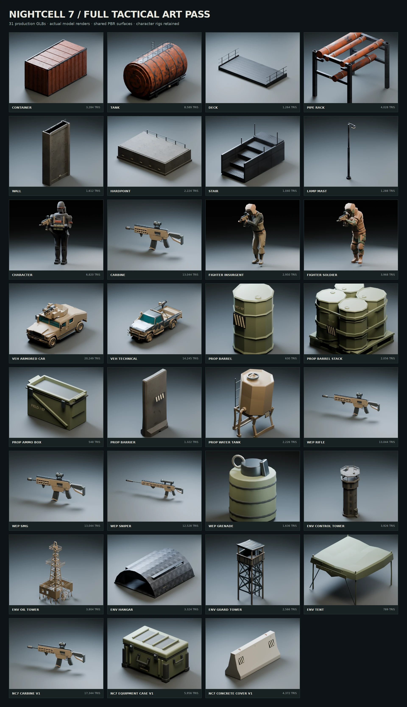

# Full tactical art overhaul

This pass covers every runtime 3D asset: all 28 previous models plus the three
approved C7 study assets. The result is a coherent, stylized military set for
this browser FPS. It is not a photoreal AAA asset library. Original weapons and
equipment share a palette with refitted licensed scenery and character meshes.

## What changed

- Six weapon GLBs: original C7 first-person carbine, four world variants, and a modeled grenade.
- Three characters: cloth, equipment and skin regions, smooth normals, new pouches/straps/patches, retained clips, and bone-attached weapon/head sockets.
- Two vehicles, seven equipment/cover props, eight yard modules, and five buildings receive shared PBR treatment and modeled hardware, markings or edge detail.
- All 22 procedural texture files are regenerated. Three legacy palette atlases are removed from runtime delivery.
- Lighting has broader fill and restrained bloom, grain and chromatic aberration. The visible sky now uses a continuous, seeded azimuth pattern, removing its UV seam.
- glTF placement uses an outer transform node. Imported handedness, skin and quantization transforms survive scaling and rotation. Cover aligns with the server volumes and the first-person muzzle faces forward.
- Four mirrored low-cover pieces and the equipment cases are integrated into the yard. Content compatibility is 1.1.0; the wire protocol remains 2.
- All ten website gallery images are replaced with actual captures of the integrated game.

## Runtime budget

The shipped models occupy **6,997,884 bytes**. Models, textures and
effect audio total **8,687,531 bytes (8.29 MiB)**,
below the unchanged **9 MiB** asset guard. Shared maps are loaded once per URL;
GLBs contain no embedded textures. Streamed music remains outside the shell.

## Validation

- Khronos glTF validator: all 31 files, zero errors. Three advisory warnings remain for inherited non-root skinned meshes; the Babylon skin/animation and placement checks pass.
- 268 repository tests pass, including loaded-GLB placement tests for cover dimensions, forward muzzle position, and cloned character clips/sockets.
- Game TypeScript check and production build pass.
- Headless Chromium/WebGL2 loads all 31 models without page or rendering errors; first-person orientation was checked in the actual game.
- Every exported model is rendered for visual review. Character preview plates include their held world weapon; triangle counts below describe the character alone.

Studio renders and website screenshots are distinct: the model sheet uses a
neutral review scene; the website gallery comes from the game's named photo
vantages. No generated concept art is presented as gameplay. Desktop GPU and
mobile frame rates still need measurement on target hardware; headless software
rendering is not a performance benchmark.

## Inventory

| Model                   | Visible triangles | Shipped size | Clips                        |
| ----------------------- | ----------------: | -----------: | ---------------------------- |
| `container`             |             3,284 |    163.0 KiB | —                            |
| `tank`                  |             8,589 |    314.3 KiB | —                            |
| `deck`                  |             1,264 |     71.2 KiB | —                            |
| `pipe_rack`             |             4,028 |    124.6 KiB | —                            |
| `wall`                  |             1,612 |     75.5 KiB | —                            |
| `hardpoint`             |             2,224 |     90.7 KiB | —                            |
| `stair`                 |             1,040 |     57.3 KiB | —                            |
| `lamp_mast`             |             1,288 |     60.3 KiB | —                            |
| `character`             |             6,820 |    398.4 KiB | death, fire, idle, run, walk |
| `carbine`               |            13,044 |    381.0 KiB | —                            |
| `fighter_insurgent`     |             2,950 |    340.5 KiB | idle, run, walk              |
| `fighter_soldier`       |             3,968 |    378.2 KiB | idle, run, walk              |
| `veh_armored_car`       |            20,249 |    804.3 KiB | —                            |
| `veh_technical`         |            14,245 |    583.3 KiB | —                            |
| `prop_barrel`           |               630 |     32.8 KiB | —                            |
| `prop_barrel_stack`     |             2,056 |    111.1 KiB | —                            |
| `prop_ammo_box`         |               548 |     23.0 KiB | —                            |
| `prop_barrier`          |             1,322 |     50.0 KiB | —                            |
| `prop_water_tank`       |             2,226 |     84.5 KiB | —                            |
| `wep_rifle`             |            13,044 |    381.3 KiB | —                            |
| `wep_smg`               |            13,044 |    380.9 KiB | —                            |
| `wep_sniper`            |            12,528 |    356.7 KiB | —                            |
| `wep_grenade`           |             1,636 |     44.9 KiB | —                            |
| `env_control_tower`     |             3,926 |    206.1 KiB | —                            |
| `env_oil_tower`         |             3,804 |    200.1 KiB | —                            |
| `env_hangar`            |             3,324 |    145.6 KiB | —                            |
| `env_guard_tower`       |             2,566 |    124.7 KiB | —                            |
| `env_tent`              |               789 |     37.6 KiB | —                            |
| `nc7_carbine_v1`        |            17,344 |    476.2 KiB | —                            |
| `nc7_equipment_case_v1` |             5,956 |    179.9 KiB | —                            |
| `nc7_concrete_cover_v1` |             4,372 |    156.0 KiB | —                            |

## Reproduction and provenance

See [`tools/art/full-set/README.md`](../../tools/art/full-set/README.md) for build,
preview, validation, and capture commands. Per-file hashes and material settings
are committed in `apps/game/public/assets/art-manifest.json`. Original work and
retained Synty/MoCap Online inputs are distinguished in
[`PROVENANCE.md`](../../apps/game/public/assets/PROVENANCE.md). Editable Blender
scenes are generated under `build/`; licensed raw masters are not redistributed.

The map addition requires the client and multiplayer service to deploy the same
content revision. The branch/PR does not itself publish the live website.
