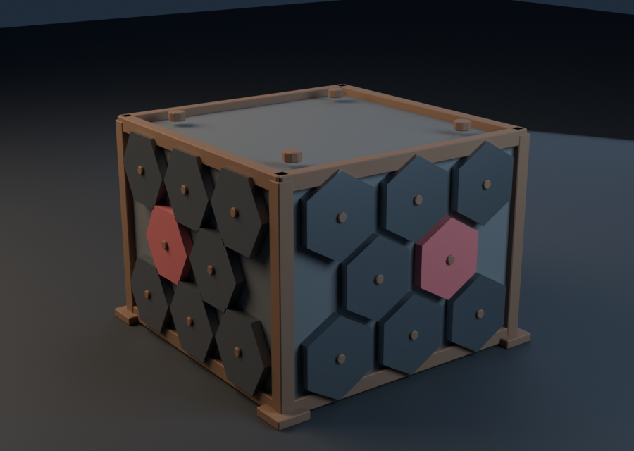

# Modular hex-armour cover

This original 4 × 4 × 3 metre tactical cover module is built for NIGHTCELL 7's
Ardavan Yard. Three instances tile each authoritative 4 × 3 × 12 metre
cross-link collision volume, so the visual cover and server-owned gameplay
geometry agree exactly.

## Production details

| Contract       | Result                                                              |
| -------------- | ------------------------------------------------------------------- |
| Runtime format | Binary glTF (`hex_cover.glb`)                                       |
| Geometry       | 4,680 triangles, 341,052 bytes                                      |
| Materials      | Shared glTF-compatible PBR slots: concrete, steel, rust, signal red |
| Textures       | No embedded images; Babylon.js binds the shared PBR texture set     |
| Collision      | Included `COL_hex_cover` proxy                                      |
| Units          | One Blender metre equals one game metre                             |
| Provenance     | Original procedural model from `tools/art/blender/hex_cover.py`     |

The asset is deterministic and rebuildable with Blender 4.5+ through
`pnpm assets:build --models-only`. Its committed generator, GLB, manifest entry,
collision contract, runtime registration and world placement are tested by
`apps/game/src/assets.test.ts` and the game build.

The preview above is also generated from the committed GLB using
`tools/art/blender/preview.py`; it is not a concept image or third-party asset.
